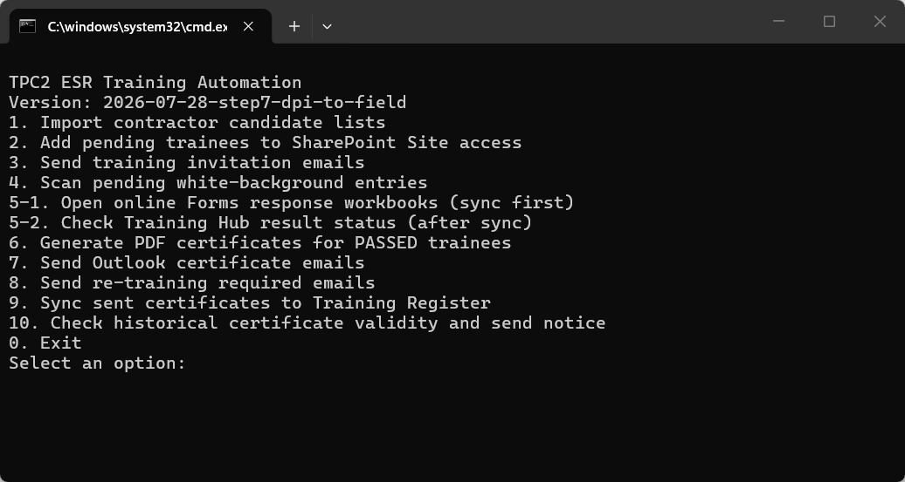

# ESR P/CP Training｜Follow the numbers

About 95% automated · Small bugs are fixed as found

  ▶️
  

    <strong>Always double-click this file first</strong>
    <code>Run ESR Training Automation (English).cmd</code>
  

  
<strong>1　Open</strong>Double-click the <code>.cmd</code> file above.

  
<strong>2　Type a number</strong>Click the black window and type, for example, <code>5-1</code>.

  
<strong>3　Press Enter</strong>The menu is not clickable. Press the keyboard <kbd>Enter</kbd> key.

{ .oaic-step-shot }

🔍 Click any instruction image to enlarge it. Use ＋／－ to zoom and Esc to close.

!!! danger "Remember: Steps 3, 7, 8 and 10 can send real emails"
    Check the name and email address before running them. The other Steps do not send emails.

### Open once each day: follow only this line

1. Type `5-1` → press **Enter** → six online result workbooks open.
2. If asked, choose your OAIC / `@oaic.io` account. Keep the pages open for **1–2 minutes**.
3. Return to the black window. Run `5-2` **only if white pending rows exist**. If there are no white rows, today's check is finished.

## Click a Step to jump to its instructions

<nav class="oaic-step-index" aria-label="ESR Training Step quick list">
  <a href="#step-1"><strong>Step 1</strong>Import contractor list<small>Writes to Register</small></a>
  <a href="#step-2"><strong>Step 2</strong>Add Site access<small>Changes SharePoint access</small></a>
  <a href="#step-3" class="oaic-step-index--danger"><strong>Step 3</strong>Send invitation<small>Sends immediately</small></a>
  <a href="#step-4"><strong>Step 4</strong>Show white rows<small>View only</small></a>
  <a href="#step-5-1"><strong>Step 5-1</strong>Open result workbooks<small>Once each day</small></a>
  <a href="#step-5-2"><strong>Step 5-2</strong>Check latest results<small>Run after 5-1</small></a>
  <a href="#step-6"><strong>Step 6</strong>Create PDF certificates<small>Creates files</small></a>
  <a href="#step-7" class="oaic-step-index--danger"><strong>Step 7</strong>Send certificates<small>Sends immediately</small></a>
  <a href="#step-8" class="oaic-step-index--danger"><strong>Step 8</strong>Send re-training email<small>Sends immediately</small></a>
  <a href="#step-9"><strong>Step 9</strong>Repair Register sync<small>Only after a failure</small></a>
  <a href="#step-10" class="oaic-step-index--danger"><strong>Step 10</strong>Check old certificate<small>Sends if valid</small></a>
</nav>

<section id="step-1" class="oaic-command-step" markdown>
## Step 1｜Import a contractor P/CP candidate list

  
<strong>WHEN</strong>You receive the completed contractor Excel list.

  
<strong>DO</strong>Place the file → type <code>1</code> → press Enter.

  
<strong>RESULT</strong>People are written to the formal Register; the source Excel moves to Archive.

1. No list yet: open `00_Template\Training email Templates` and send `1. Person _ CP Candidate Request.oft`.
2. When the Excel file returns, place it in `01_Inbox\P_CP Candidate Lists`.
3. Open the English `.cmd`, type `1`, then press **Enter**.
4. `Done. Imported...` means the import is complete.
5. If `CONTRACTOR REPLY - Candidate Validity Confirmation` appears, open Template 2, paste the text copied by the tool, and send it to the contractor.

{ .oaic-step-shot loading=lazy }

{ .oaic-step-shot loading=lazy }

{ .oaic-step-shot loading=lazy }
</section>

<section id="step-2" class="oaic-command-step" markdown>
## Step 2｜Add SharePoint Site access

  
<strong>WHEN</strong>Step 1 added new white pending rows.

  
<strong>DO</strong>Type <code>2</code>, press Enter, then choose Chrome, Edge, or Firefox.

  
<strong>RESULT</strong>The candidate receives ESR Training Hub Site access.

1. Type `2`, then press **Enter**.
2. At the browser question, press **Enter** for Chrome, type `E` for Edge, or type `F` for Firefox.
3. Do not use the mouse or keyboard while it is running.
4. `完成 SharePoint Site access：成功 ...` means “Site access completed” and confirms it is finished.

!!! note "No white pending rows"
    There is nothing to process. Return to the menu.
</section>

<section id="step-3" class="oaic-command-step oaic-command-step--danger" markdown>
## Step 3｜Send a Training invitation

  
<strong>WHEN</strong>The person has completed Step 2.

  
<strong>DO</strong>Type <code>3</code>, then enter one trainee email.

  
<strong>RESULT</strong>Outlook immediately sends that person's Training invitation.

1. Confirm which person should receive the invitation.
2. Type `3`, then press **Enter**.
3. Enter the requested **single email address**, then press **Enter**.
4. Only `SENT: ... training invitation` confirms that it was sent.

!!! danger "This Step sends an email"
    If the email is wrong, do not press Enter. Close the black window and start again.
</section>

<section id="step-4" class="oaic-command-step" markdown>
## Step 4｜Show white pending rows

  
<strong>WHEN</strong>You want to see who is still waiting.

  
<strong>DO</strong>Type <code>4</code>, then press Enter.

  
<strong>RESULT</strong>The black window lists names, levels and emails. Nothing is changed.

`目前沒有偵測到白底待處理人員` means “No white pending rows detected”. Nobody needs Steps 5-2, 6 or 7 at this time.
</section>

<section id="step-5-1" class="oaic-command-step oaic-command-step--daily" markdown>
## Step 5-1｜Open online result workbooks first

  
<strong>WHEN</strong>Once when you open the tool each day.

  
<strong>DO</strong>Type <code>5-1</code> → choose a browser → wait 1–2 minutes.

  
<strong>RESULT</strong>Six Microsoft Forms response workbooks open and update the local results.

1. Type `5-1`, then press **Enter**.
2. Press **Enter** for Chrome. Type `E` only for Edge.
3. Six result pages open. If Microsoft asks for an account, choose your OAIC / `@oaic.io` account.
4. Keep the pages open and wait **1–2 minutes**.
5. Return to the same black window and continue with Step 5-2.
</section>

<section id="step-5-2" class="oaic-command-step oaic-command-step--daily" markdown>
## Step 5-2｜Check the latest Training Hub results

  
<strong>WHEN</strong>Step 5-1 has synced and white pending rows still exist.

  
<strong>DO</strong>Type <code>5-2</code>, then press Enter.

  
<strong>RESULT</strong>Each candidate shows <code>PASSED</code> or <code>WAIT</code>.

- Person: total score `≥ 36` is PASSED.
- CP: Module 1 `≥ 20` **and** Module 2 `≥ 20` are both required.
- `WAIT`: do not continue to Steps 6 or 7.
- `PASSED`: continue to Step 6.

{ .oaic-step-shot .oaic-step-shot--tall loading=lazy }
</section>

<section id="step-6" class="oaic-command-step" markdown>
## Step 6｜Create PDF certificates

  
<strong>WHEN</strong>Step 5-2 shows PASSED.

  
<strong>DO</strong>Type <code>6</code>, then press Enter.

  
<strong>RESULT</strong>Person / CP PDF certificates are created in <code>04_Certificates</code>.

1. Type `6`, then press **Enter**.
2. `完成，已自動產生以上 PDF 證書` means the PDF certificates were generated.
3. Open `04_Certificates` and check the name, level and PDF.

{ .oaic-step-shot .oaic-step-shot--tall loading=lazy }
</section>

<section id="step-7" class="oaic-command-step oaic-command-step--danger" markdown>
## Step 7｜Send Certificate emails

  
<strong>WHEN</strong>You have checked every PDF created by Step 6.

  
<strong>DO</strong>Type <code>7</code>, then press Enter.

  
<strong>RESULT</strong>All ready certificates are sent and the Register sync is attempted.

1. Close unrelated Outlook drafts.
2. Type `7`, then press **Enter**.
3. If an “unconfirmed” retry list appears, enter a number/email only for a retry. Press **Enter** for the normal pending list.
4. Each person needs `SENT: email`, followed by `Register synchronization completed`.

!!! danger "This sends every certificate that is ready"
    Check all PDFs in `04_Certificates` first. Do not use Step 7 as a test.
</section>

<section id="step-8" class="oaic-command-step oaic-command-step--danger" markdown>
## Step 8｜Send Re-training Required emails

  
<strong>WHEN</strong>Step 5-2 confirmed that a person failed and must retake training.

  
<strong>DO</strong>Type <code>8</code>, then press Enter.

  
<strong>RESULT</strong>All confirmed failed trainees not yet notified receive a re-training email.

1. Use Step 5-2 first and confirm who failed.
2. Only after the list is correct, type `8`, then press **Enter**.
3. The tool lists the recipients and continues with sending. Only `SENT: re-training required email` confirms success.

!!! danger "This Step sends emails"
    If you are unsure who will receive them, do not run it.
</section>

<section id="step-9" class="oaic-command-step" markdown>
## Step 9｜Repair the Training Register sync

  
<strong>WHEN</strong>Only when Step 7 sent the email but reported a Register sync failure.

  
<strong>DO</strong>Close the Register workbook → type <code>9</code> → press Enter.

  
<strong>RESULT</strong>Sent status, certificate number and dates are written back to the Register.

Normally, do **not** run Step 9. If Step 7 shows `Register synchronization completed`, you are finished.
</section>

<section id="step-10" class="oaic-command-step oaic-command-step--danger" markdown>
## Step 10｜Check an old valid certificate and send notice

  
<strong>WHEN</strong>A trainee says they passed before, but Step 5-2 finds no result.

  
<strong>DO</strong>Type <code>10</code>, then enter the full email address.

  
<strong>RESULT</strong>If a certificate is still valid, an English validity notice is sent immediately.

1. Type `10`, then press **Enter**.
2. Enter the trainee's **full email address**, then press **Enter**. Email is safer than a name.
3. No match, an expired certificate or an ambiguous name stops without sending.
4. `SENT: email` confirms that the English validity notice was sent.

!!! danger "A valid result sends an email immediately"
    Check the email again before pressing Enter. Do not guess with a partial name.
</section>

First use: install tools + show Outlook Bcc

1. Double-click `Install ESR Automation Prerequisites.cmd`.
2. Wait for `Python packages OK`.
3. Outlook: **File → Settings**.

{ .oaic-step-shot loading=lazy }

4. **Mail → Compose → Always show Bcc**.

{ .oaic-step-shot loading=lazy }

Where are the folders?

- Main tool folder: `OAIC Ltd\PROJECT_TWSHXESR - Documents\General\ESR AutoDoc Hub\04_ESR Training`
- Contractor lists: `01_Inbox\P_CP Candidate Lists`
- Email templates: `00_Template\Training email Templates`
- Training results: `02_Processing`
- Certificates: `04_Certificates`
- Formal Register: `Safety Document - SFD Register\TWSHXHV_ESR_OverallRegister.xlsm`
- Worksheet written by the tool: `Old Training Register`

!!! tip "Stuck?"
    Close related Excel files and Outlook drafts, then run the same Step again from the English `.cmd`. If the screen shows `FAILED`, `ERROR` or `WARNING`, take a screenshot before continuing.
