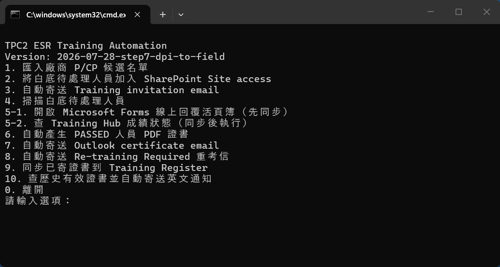

# ESR P/CP Training｜照著號碼做

約 95% 自動化 · 發現小 bug 會持續修正

  ▶️
  

    <strong>每次都雙擊這個檔案開始</strong>
    <code>Run ESR Training Automation (中文).cmd</code>
  

  
<strong>1　打開</strong>雙擊上面的 <code>.cmd</code> 檔。

  
<strong>2　輸入號碼</strong>點一下黑色視窗，輸入例如 <code>5-1</code>。

  
<strong>3　按 Enter</strong>不是點選單。輸入號碼後按鍵盤 <kbd>Enter</kbd>。

{ .oaic-step-shot }

🔍 點一下任何操作圖片即可放大；用 ＋／－ 縮放，按 Esc 關閉。

!!! danger "先記住：Step 3、7、8、10 會真的寄出 Email"
    執行前先看清楚姓名與 Email。其他 Step 不會寄信。

### 每天打開一次：只做這條線

1. 輸入 `5-1` → 按 **Enter** → 會開啟 6 份線上成績活頁簿。
2. 若要選帳號，選自己的 OAIC／`@oaic.io` 帳號；保持頁面開啟 **1–2 分鐘**。
3. 回到黑色視窗。**有白底待處理人員**才輸入 `5-2`；沒有白底人員，今天就完成。

## 點 Step，直接跳到操作說明

<nav class="oaic-step-index" aria-label="ESR Training Step 快速列表">
  <a href="#step-1"><strong>Step 1</strong>匯入廠商名單<small>寫入 Register</small></a>
  <a href="#step-2"><strong>Step 2</strong>加入 Site access<small>變更 SharePoint 權限</small></a>
  <a href="#step-3" class="oaic-step-index--danger"><strong>Step 3</strong>寄 Training invitation<small>會立即寄信</small></a>
  <a href="#step-4"><strong>Step 4</strong>查看白底人員<small>只查看</small></a>
  <a href="#step-5-1"><strong>Step 5-1</strong>開線上成績檔同步<small>每天一次</small></a>
  <a href="#step-5-2"><strong>Step 5-2</strong>查最新成績<small>5-1 後執行</small></a>
  <a href="#step-6"><strong>Step 6</strong>產生 PDF 證書<small>建立檔案</small></a>
  <a href="#step-7" class="oaic-step-index--danger"><strong>Step 7</strong>寄 Certificate<small>會立即寄信</small></a>
  <a href="#step-8" class="oaic-step-index--danger"><strong>Step 8</strong>寄重考信<small>會立即寄信</small></a>
  <a href="#step-9"><strong>Step 9</strong>補同步 Register<small>只有失敗時使用</small></a>
  <a href="#step-10" class="oaic-step-index--danger"><strong>Step 10</strong>查舊證書並通知<small>有效時會寄信</small></a>
</nav>

<section id="step-1" class="oaic-command-step" markdown>
## Step 1｜匯入廠商 P/CP 候選名單

  
<strong>什麼時候做</strong>收到廠商回填的 Excel 名單時。

  
<strong>你要做什麼</strong>放檔案 → 輸入 <code>1</code> → 按 Enter。

  
<strong>會產生什麼</strong>人員寫入正式 Register；原始 Excel 移到 Archive。

1. 尚未取得名單：開啟 `00_Template\Training email Templates`，寄出 `1. Person _ CP Candidate Request.oft`。
2. 收到 Excel：放進 `01_Inbox\P_CP Candidate Lists`。
3. 打開中文 `.cmd`，輸入 `1`，按 **Enter**。
4. 看到 `Done. Imported...` 代表完成。
5. 若畫面出現 `CONTRACTOR REPLY - Candidate Validity Confirmation`：開啟 Template 2，貼上工具已複製的內容，再寄給廠商。

{ .oaic-step-shot loading=lazy }

{ .oaic-step-shot loading=lazy }

{ .oaic-step-shot loading=lazy }
</section>

<section id="step-2" class="oaic-command-step" markdown>
## Step 2｜加入 SharePoint Site access

  
<strong>什麼時候做</strong>Step 1 新增了白底待處理人員。

  
<strong>你要做什麼</strong>輸入 <code>2</code>，按 Enter；再選擇 Chrome、Edge 或 Firefox。

  
<strong>會產生什麼</strong>候選人取得 ESR Training Hub Site access。

1. 輸入 `2`，按 **Enter**。
2. 看到選擇瀏覽器：直接按 **Enter** 使用 Chrome；輸入 `E` 使用 Edge；輸入 `F` 使用 Firefox。
3. 執行時不要碰滑鼠或鍵盤。
4. 看到 `完成 SharePoint Site access：成功 ...` 代表完成。

!!! note "看到沒有白底人員"
    代表目前不需處理；回到選單即可。
</section>

<section id="step-3" class="oaic-command-step oaic-command-step--danger" markdown>
## Step 3｜寄出 Training invitation

  
<strong>什麼時候做</strong>該人員已完成 Step 2。

  
<strong>你要做什麼</strong>輸入 <code>3</code>，再輸入一位人員的 Email。

  
<strong>會產生什麼</strong>Outlook 立即寄出該人員的 Training invitation。

1. 先確認要寄給哪一位人員。
2. 輸入 `3`，按 **Enter**。
3. 輸入畫面要求的**單一 Email**，再按 **Enter**。
4. 看到 `SENT: ... training invitation` 才代表寄出成功。

!!! danger "這一步會寄信"
    Email 輸錯時先不要按 Enter。直接關閉黑色視窗，再重新開始。
</section>

<section id="step-4" class="oaic-command-step" markdown>
## Step 4｜查看白底待處理人員

  
<strong>什麼時候做</strong>想先確認目前有哪些人尚未完成時。

  
<strong>你要做什麼</strong>輸入 <code>4</code>，按 Enter。

  
<strong>會產生什麼</strong>只在黑色視窗列出姓名、等級與 Email；不修改檔案。

看到 `目前沒有偵測到白底待處理人員`，代表現在沒有要繼續跑 5-2、6、7 的人。
</section>

<section id="step-5-1" class="oaic-command-step oaic-command-step--daily" markdown>
## Step 5-1｜每天先開線上成績檔同步

  
<strong>什麼時候做</strong>每天打開工具時，先做一次。

  
<strong>你要做什麼</strong>輸入 <code>5-1</code> → 選瀏覽器 → 等 1–2 分鐘。

  
<strong>會產生什麼</strong>開啟 6 份 Microsoft Forms 線上回覆活頁簿，更新本機成績。

1. 輸入 `5-1`，按 **Enter**。
2. 直接按 **Enter** 使用 Chrome；要用 Edge 才輸入 `E`。
3. 瀏覽器會開啟 6 個成績頁面。若 Microsoft 詢問帳號，選自己的 OAIC／`@oaic.io` 帳號。
4. 不要關頁面，等待 **1–2 分鐘**。
5. 回到原本的黑色視窗，再做 Step 5-2。
</section>

<section id="step-5-2" class="oaic-command-step oaic-command-step--daily" markdown>
## Step 5-2｜查 Training Hub 最新成績

  
<strong>什麼時候做</strong>Step 5-1 同步完成，而且 Register 還有白底人員。

  
<strong>你要做什麼</strong>輸入 <code>5-2</code>，按 Enter。

  
<strong>會產生什麼</strong>每位人員顯示 <code>PASSED</code> 或 <code>WAIT</code>。

- Person：總分 `≥ 36` 才是 PASSED。
- CP：Module 1 `≥ 20` **而且** Module 2 `≥ 20` 才是 PASSED。
- `WAIT`：先不要做 Step 6 或 7。
- `PASSED`：可以繼續 Step 6。

{ .oaic-step-shot .oaic-step-shot--tall loading=lazy }
</section>

<section id="step-6" class="oaic-command-step" markdown>
## Step 6｜產生 PDF 證書

  
<strong>什麼時候做</strong>Step 5-2 顯示 PASSED。

  
<strong>你要做什麼</strong>輸入 <code>6</code>，按 Enter。

  
<strong>會產生什麼</strong>在 <code>04_Certificates</code> 建立 Person／CP PDF 證書。

1. 輸入 `6`，按 **Enter**。
2. 看到 `完成，已自動產生以上 PDF 證書` 代表完成。
3. 打開 `04_Certificates`，確認姓名、等級與 PDF。

{ .oaic-step-shot .oaic-step-shot--tall loading=lazy }
</section>

<section id="step-7" class="oaic-command-step oaic-command-step--danger" markdown>
## Step 7｜寄出 Certificate email

  
<strong>什麼時候做</strong>已檢查 Step 6 產生的 PDF。

  
<strong>你要做什麼</strong>輸入 <code>7</code>，按 Enter。

  
<strong>會產生什麼</strong>寄出所有待寄證書，並嘗試自動同步 Register。

1. 先關閉不相關的 Outlook 草稿。
2. 輸入 `7`，按 **Enter**。
3. 若出現「未確認寄出」清單，只在要重寄時輸入編號／Email；一般處理直接按 **Enter**。
4. 每人看到 `SENT: email`，最後看到 `Register 同步完成`，才算完整完成。

!!! danger "這一步會寄出所有待寄證書"
    執行前先在 `04_Certificates` 檢查全部 PDF。不要用 Step 7 測試。
</section>

<section id="step-8" class="oaic-command-step oaic-command-step--danger" markdown>
## Step 8｜寄出 Re-training Required 重考信

  
<strong>什麼時候做</strong>Step 5-2 已確認有人未通過，需要重考。

  
<strong>你要做什麼</strong>輸入 <code>8</code>，按 Enter。

  
<strong>會產生什麼</strong>向所有已確認未通過、尚未通知的人寄出重考信。

1. 先用 Step 5-2 確認哪些人未通過。
2. 確認名單正確後才輸入 `8`，按 **Enter**。
3. 系統會列出收件人並直接處理寄送；看到 `SENT: re-training required email` 才代表成功。

!!! danger "這一步會寄信"
    如果不確定誰會收到，先不要執行。
</section>

<section id="step-9" class="oaic-command-step" markdown>
## Step 9｜補同步已寄證書到 Training Register

  
<strong>什麼時候做</strong>只有 Step 7 已寄信，但畫面顯示 Register 同步失敗時。

  
<strong>你要做什麼</strong>關閉 Register Excel → 輸入 <code>9</code> → 按 Enter。

  
<strong>會產生什麼</strong>把已寄證書狀態、證書號碼與日期補寫回 Register。

正常情況 **不用** 執行 Step 9。看到 `Register 同步完成` 就可以離開。
</section>

<section id="step-10" class="oaic-command-step oaic-command-step--danger" markdown>
## Step 10｜查歷史有效證書並寄英文通知

  
<strong>什麼時候做</strong>測試者說以前已通過，但 Step 5-2 找不到成績。

  
<strong>你要做什麼</strong>輸入 <code>10</code>，再輸入完整 Email。

  
<strong>會產生什麼</strong>若找到仍有效證書，立即寄出英文有效通知；無效則不寄。

1. 輸入 `10`，按 **Enter**。
2. 輸入測試者的**完整 Email**，再按 **Enter**。Email 比姓名安全。
3. 系統找不到、已過期或姓名對到多人時，會停止且不寄信。
4. 找到仍有效證書時，看到 `SENT: email` 代表英文通知已寄出。

!!! danger "有效時會立即寄信"
    輸入前再次確認 Email；不要用不完整姓名猜測。
</section>

第一次使用：安裝工具 + 顯示 Outlook Bcc

1. 雙擊 `Install ESR Automation Prerequisites.cmd`。
2. 等待顯示 `Python packages OK`。
3. Outlook：**File → Settings**。

{ .oaic-step-shot loading=lazy }

4. **Mail → Compose → Always show Bcc**。

{ .oaic-step-shot loading=lazy }

資料夾在哪裡

- 工具主資料夾：`OAIC Ltd\PROJECT_TWSHXESR - Documents\General\ESR AutoDoc Hub\04_ESR Training`
- 廠商名單：`01_Inbox\P_CP Candidate Lists`
- Email templates：`00_Template\Training email Templates`
- Training results：`02_Processing`
- Certificates：`04_Certificates`
- 正式 Register：`Safety Document - SFD Register\TWSHXHV_ESR_OverallRegister.xlsm`
- 工具寫入的工作頁：`Old Training Register`

!!! tip "卡住？"
    先關閉相關 Excel 與 Outlook 草稿，再回到中文 `.cmd` 重跑同一個 Step。畫面若出現 `FAILED`、`ERROR` 或 `WARNING`，先截圖，不要直接跳到下一步。
