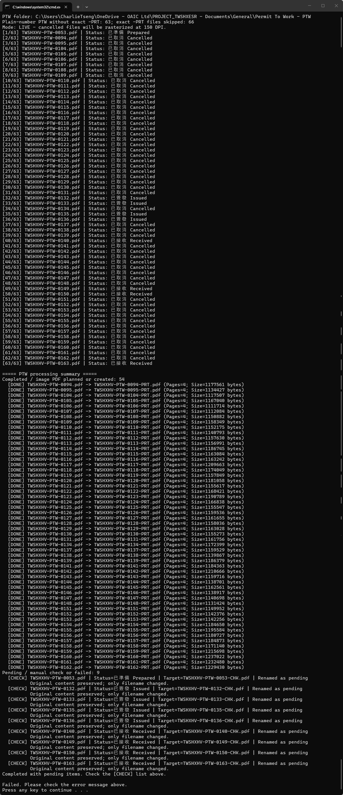
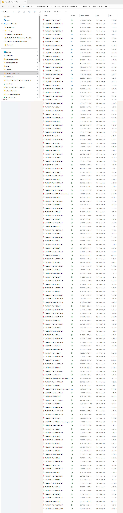

# PTW Cancelled PDF｜4 steps

The tool checks each PTW Status: `Cancelled` creates `-PRT.pdf`; every other status is renamed to `-CHK.pdf` for review.

<section class="oaic-visual-step">
  
1

  
🖱️

  

    <h2>Double-click the .cmd file in the PTW folder</h2>
    <code>Process Cancelled PTW - Run.cmd</code>
  

</section>

{ .oaic-step-shot loading=lazy }

<section class="oaic-visual-step">
  
2

  
🔎

  

    <h2>Wait while the tool checks each Status</h2>
    
The window shows the file name, progress and detected status.

  

</section>

{ .oaic-step-shot loading=lazy }

<section class="oaic-visual-step">
  
3

  
✅

  

    <h2>Cancelled creates -PRT.pdf</h2>
    
The original PDF is kept; the new file is an image-only PDF.

  

</section>

{ .oaic-step-shot loading=lazy }

<section class="oaic-visual-step oaic-visual-step--check">
  
4

  
📁

  

    <h2>Check [DONE], [CHECK] and the output files</h2>
    
<strong>[DONE]</strong> = <code>-PRT.pdf</code> created｜<strong>[CHECK]</strong> = renamed to <code>-CHK.pdf</code>

  

</section>

{ .oaic-step-shot loading=lazy }

{ .oaic-step-shot .oaic-step-shot--tall loading=lazy }

!!! warning "Known issue in this example"
    The screenshot ends with `Failed`; the program is still being adjusted. For now, verify the `[DONE]` / `[CHECK]` lists and the actual `-PRT` / `-CHK` files.

{ .oaic-step-shot .oaic-step-shot--tall loading=lazy }

Processing rules and optional mode

- Processes only `TWSHXHV-PTW-####.pdf` files without an exact matching `-PRT.pdf`.
- `Cancelled`: keeps the original PDF and creates an image-only `-PRT.pdf`.
- Other statuses: keeps the content and renames the file to `-CHK.pdf` for manual review.
- Existing files are never overwritten.
- Temporary PNG files use Windows `%TEMP%` and are removed when processing finishes.
- To open files one by one, run the PowerShell script with `-OpenEach`.

