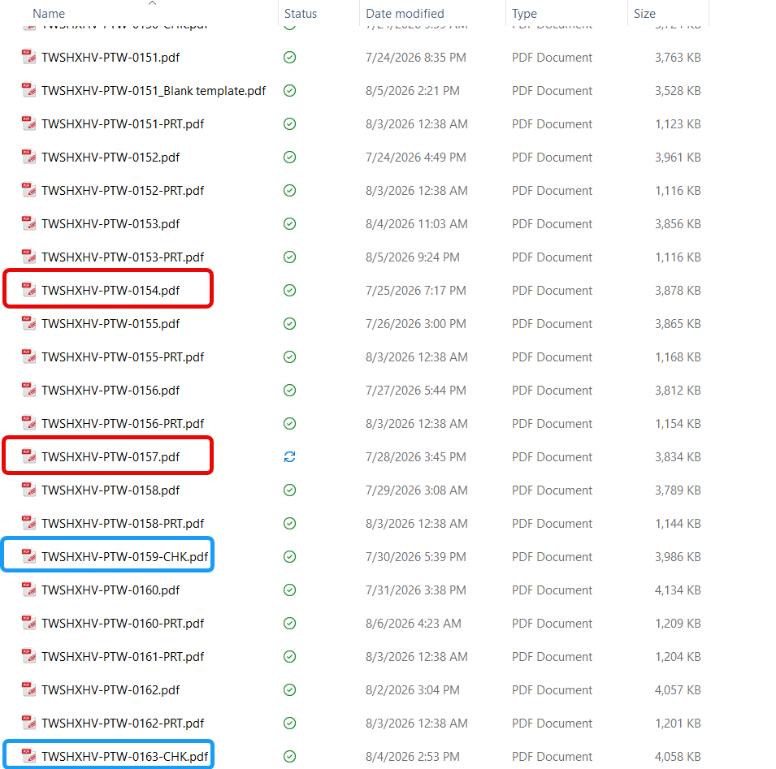
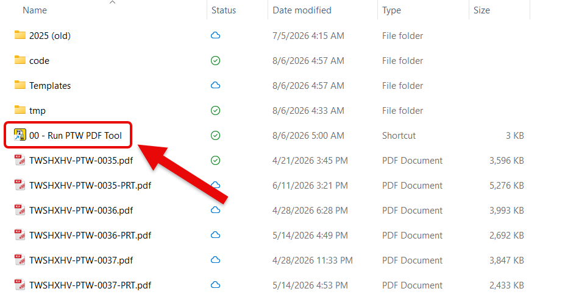
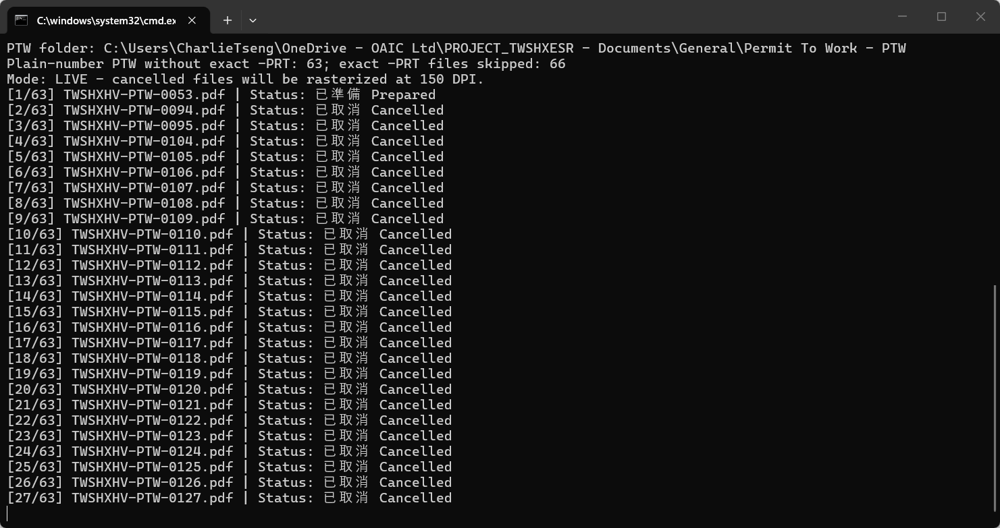
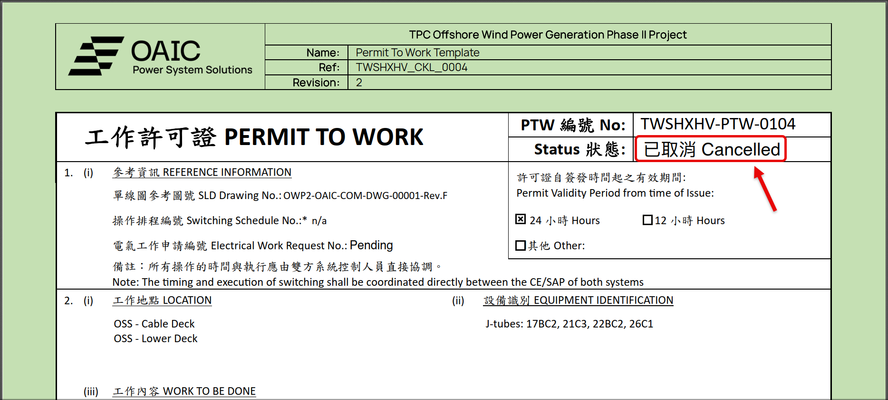
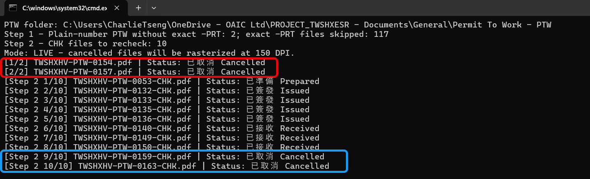
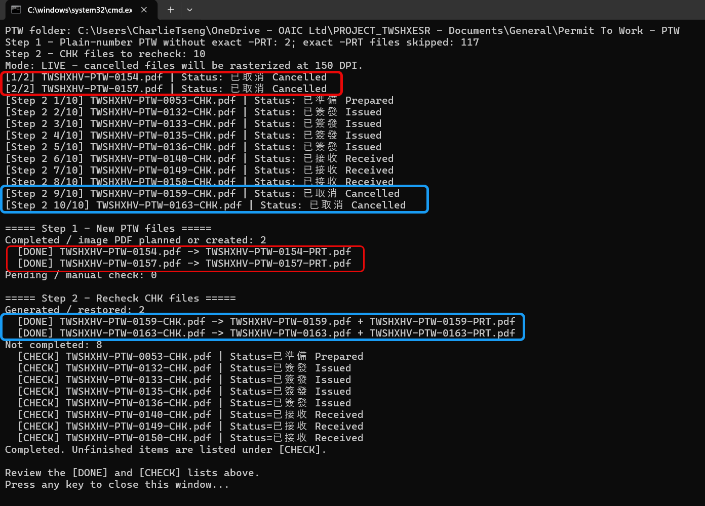
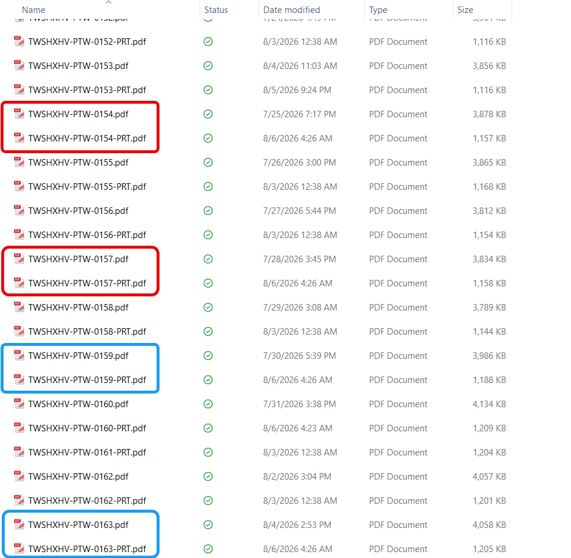

# 產生圖片化 PTW PDF｜5 步完成

一次執行兩輪檢查：處理新的 PTW，並重新檢查既有的 `-CHK.pdf`。

<section class="oaic-visual-step">
  
1

  
🖱️

  

    <h2>確認檔案後，雙擊 .cmd</h2>
    <code>Process Cancelled PTW - Run.cmd</code>
  

</section>

{ .oaic-step-shot .oaic-step-shot--tall loading=lazy }

{ .oaic-step-shot loading=lazy }

<section class="oaic-visual-step">
  
2

  
🔎

  

    <h2>等待第一輪檢查新 PTW</h2>
    
畫面會顯示檔名、進度及 Status。

  

</section>

{ .oaic-step-shot loading=lazy }

<section class="oaic-visual-step">
  
3

  
✅

  

    <h2>查看第一輪結果</h2>
    
<strong>Cancelled</strong> → 建立 <code>-PRT.pdf</code> <strong>其他狀態</strong> → 改名為 <code>-CHK.pdf</code>

  

</section>

{ .oaic-step-shot loading=lazy }

{ .oaic-step-shot loading=lazy }

<section class="oaic-visual-step oaic-visual-step--check">
  
4

  
🔁

  

    <h2>第二輪會重新檢查 -CHK.pdf</h2>
    
<strong>已改為 Cancelled</strong> → 恢復原檔名並建立 <code>-PRT.pdf</code> <strong>尚未 Cancelled</strong> → 保留 <code>-CHK.pdf</code>

  

</section>

{ .oaic-step-shot loading=lazy }

<section class="oaic-visual-step oaic-visual-step--check">
  
5

  
📋

  

    <h2>查看摘要，再按任意鍵關閉</h2>
    
<strong>[DONE]</strong> = 已完成｜<strong>[CHECK]</strong> = 尚待完成 視窗會停留，不會自動消失。

  

</section>

{ .oaic-step-shot .oaic-step-shot--tall loading=lazy }

{ .oaic-step-shot .oaic-step-shot--tall loading=lazy }

處理規則與選用功能

- 第一輪：檢查沒有同編號 exact `-PRT.pdf` 的 `TWSHXHV-PTW-####.pdf`。
- 第一輪 `Cancelled`：保留原始 PDF，另建影像化 `-PRT.pdf`。
- 第一輪其他狀態：保留內容，只將檔名改為 `-CHK.pdf`。
- 第二輪：重新檢查全部 `TWSHXHV-PTW-####-CHK.pdf`。
- `-CHK.pdf` 已改為 `Cancelled`：恢復原檔名並建立影像化 `-PRT.pdf`。
- `-CHK.pdf` 尚未 `Cancelled`：檔名不變，列於 `[CHECK]`。
- 不覆寫既有檔案。
- 中間 PNG 存於 Windows `%TEMP%`，完成後自動清理。
- 如需逐份開啟，可執行 PowerShell 程式並加上 `-OpenEach`。

